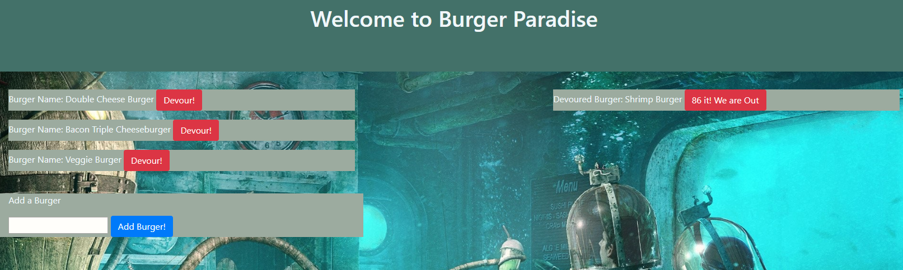
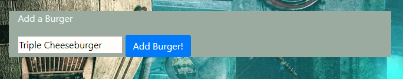
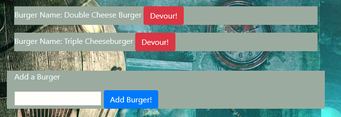
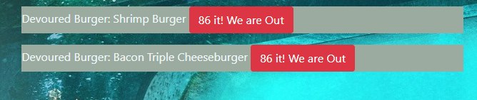

# burger-the-sequel

This app will allow the user to add an item ot the menu and devour it or already existing items then remove them if the restaurant is sold out.

## Overview

Welcome to the Burger app! This app will allow the user to add to an existing menu then devour them. It will show the devoured items on the right of the page and any un-devoured items on the left of the page. The user cna also "86" or remove an item from the menu after i9t has been devoured. At the bottom is an input box to add any item the user would like.

## Instructions

### Heroku Instructions

1. Navigate to the heroku page for the app using the link at the bottom of this README.    
* https://burgerapp2epv1001.herokuapp.com/

2. You should be redirected to a new page with the current menu options.  

3. Once you have navigated to this page you are able to devour burgers that are currently on the menu using the "Devour!" button to the right of each option. When an item is successfully devoured it will move tot eh right side of the web page.  
* Before Click  
  

* After Click  
  

4. You can also add to the menu by going to the submission box at the bottom of the page. Just type the name of the burger or item you would like to add to the menu and click the "Add Burger" button located below th input box.  

5. After step 4 is successfully completed you will see the new item you added at the bottom of the menu with a devour button to the right of it. When an item is successfully devoured it will move to teh right side of the web page.  

6. When you would like to remove a burger from the devoured menu click the "86 it! We are out" button.
* Before Click  
  

* After Click  
  

## Links

### Heroku Page

https://burgerapp2epv1001.herokuapp.com/

### Git-Hub Page

https://github.com/EricVincitore/burger-the-sequel

## Technologies Used

* HTML5
* Bootstrap
* Javascript
* Node.js
* Handlebars
* Express
* Heroku
* MySql
* Sequelize

## Development Role

This app was developed by Eric Vincitore.